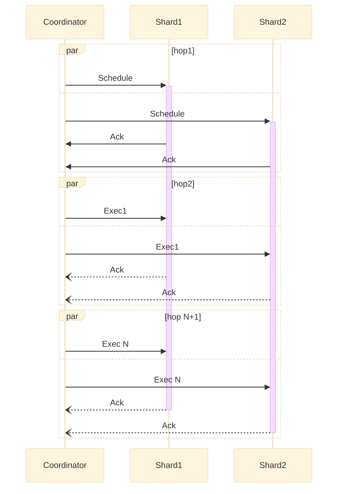

# Life of a transaction

This document describes how Dragonfly transactions provide atomicity and serializability for its multi-key and multi-command operations.

Note that simple, single-key operations are already linearizable in a shared-nothing architecture because each shard-thread performs operations on its keys sequentially.
The complexity rises when we need to provide strict-serializability (aka serializability and linearizability) for multiple keys.

Transactions in Dragonfly are orchestrated by an abstract entity, called coordinator.
In reality, a client connection instance takes on itself the role of a coordinator: it coordinates transactions every time it executes a redis or memcached command. The algorithm behind Dragonfly transactions is based on the [VLL paper](https://www.cs.umd.edu/~abadi/papers/vldbj-vll.pdf).

Every step within a coordinator is done sequentially. Therefore, it's easier to describe the flow using a sequence diagram. Below is a sequence diagram of a generic transaction consisting of multiple execution steps. In this diagram, the operation it executes touches keys in two different shards: `Shard1` and `Shard2`.

The shared-nothing architecture of Dragonfly does not allow accessing each shard data directly from a coordinator fiber. Instead, the coordinator sends messages to the shards and instructs them what to do at each step. Every time, the coordinator sends a message, it blocks until it gets an answer. We call such interaction a *message hop* or a *hop* in short.

The flow consists of two different phases: *scheduling* a transaction, and *executing* it. The execution phase may consist of one or more hops, depending on the complexity of the operation we model.

*Note, that when a coordinator fiber is blocked, its thread can still execute other tasks - like processing requests in other connections or handle operations for the shard it owns. This is the advantage of adopting fibers - they allows us to separate the execution context from OS threads.*

## Scheduling a transaction

The transaction initiates with a scheduling hop, during which the coordinator sends to each shard the keys that shards touches. The coordinator sends messages to multiple shards concurrently but it waits until all shards ack and confirm that the scheduling succeeded before it proceeds to the next steps.

Once the scheduling message is processed by a receiving shard, it adds the transaction to its local transaction queue (tx-queue). In order to provide serializability, i.e. to make sure that all shards order their scheduled transactions in the same order, Dragonfly maintains a global sequence counter that is used to induce a total order for all its transactions.

This global counter is shared by all coordinator entities and is represented by an atomic integer. *This counter may be a source of contention - it breaks the shared nothing model, after all. However, in practice, we have not observed a significant impact on Dragonfly performance due to other optimizations we added. These will be detailed in sections below*.

The tx-queue in each shard is ordered by the seq-number of each transaction. It may be that scheduling messages will arrive to each shard in a different order, which may cause that transactions with larger id be scheduled before transactions with a smaller id. If the scheduling algorithm fails to reorder the last transaction, it fails the scheduling request and the coordinator retries the whole hop again by allocating a new sequence number. In reality the fail-rate of a scheduling attempt is very low and the retries happen very rarely.

Once the transaction is added to the tx-queue, the shard also marks the keys it touches using the *intent* locks. Those locks do not block the flow of the underlying oepration but mere express the intent to touch or modify the key. In reality, they are represented by a map: `lock:str->counter`. If `lock[key] == 2` it means the tx-queue has 2 pending transactions that plan to modify `key`. These intent locks are used for optimizations detailed below and are not required to implement the naive version of VLL algorithm.

Once the scheduling hops converges, it means that the transaction entered the execution phase, in which it never rollbacks, or retries. Once it's been scheduled, VLL guarantees the progress of subsequent execution operations while providing strict-serializability guarantees.

It's important to note that a scheduled transaction does not hold exclusivity on its keys. There could be other transactions that still mutate keys it touches - these transactions were scheduled earlier and have not finished running yet, or even have not even started running.

## Executing a transaction

Once the transaction is scheduled, the coordinator starts sending the execution messages. We break each command to one or more micro-ops and each operation corresponds to a single message hop.

For example, "MSET" corresponds to a single micro-op "mset" that has the same semantics, but runs in parallel on all the involved shards.

However, "RENAME" requires two micro-ops: fetching the data from two keys, and then the second hop - deleting/writing a key (depending whether the key is a source or a destination).

When a coordinator schedules an execution, it also specifies whether this execution is the last hop for that command. This is necessary, so that shards could do the  clean-ups when running the last execution request.

Once a coordinator sends the micro-op request to all the shards, it waits for the answer. Only when all shards executed the micro-op and return the result, the coordinator is unblocked and it can proceed to the next hop. The coordinator is allowed to process the intermediary responses from the previous hops in order to define the next execution request.

The shards always execute transactions at the head of the tx-queue. When the last execution hop for that transaction is executed the transaction is removed from the queue and the next one can be executed. This way we maintain the ordering guarantees specified by the scheduling order of the transactions and we maintain the atomicity of operations across multiple shards.

## Multi-op transactions (Redis transactions)

## Optimizations

## Blocking commands (BLPOP)
